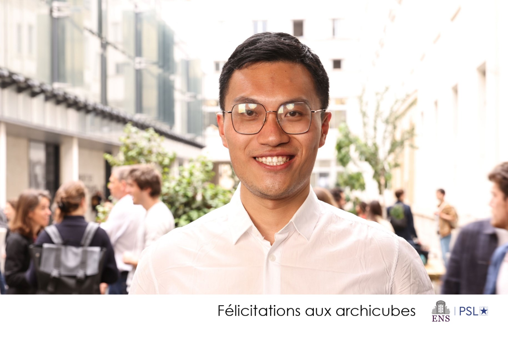

I am a postdoc working in Arithmetic Geometry and Number theory  at McGill university, my advisor is Patrick Allen. Before  I  was a PhD student    at Institut de Recherche Mathématique Avancée, Strasbourg.
My advisors were Adriano Marmora and Yichao Tian.

